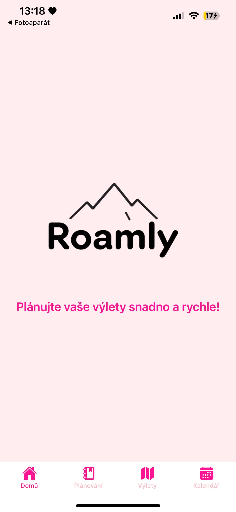
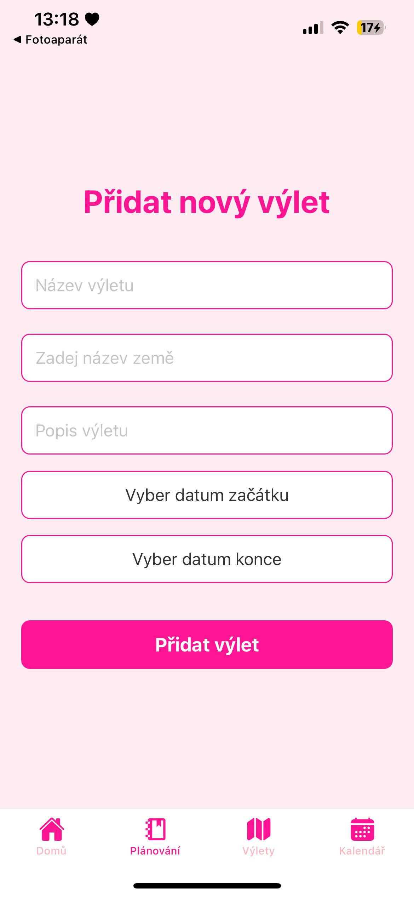
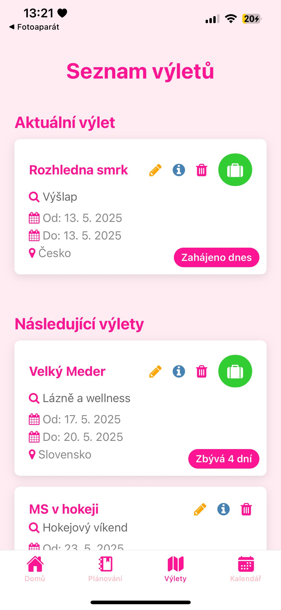
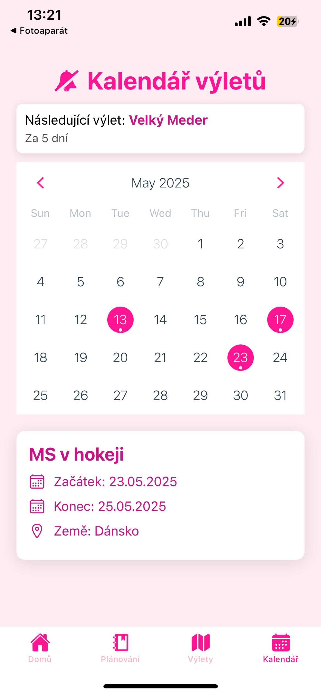

# Roamly – Mobilní aplikace pro plánování výletů

Aplikace **Roamly** slouží k plánování výletů a správě balicích seznamů podle typu výletu. Byla vyvinuta jako bakalářský projekt v rámci studia na **Technické univerzitě v Liberci**.

---

##  Funkce aplikace
- Přehled všech výletů rozdělený na:
  - **Aktuální výlety**
  - **Plánované výlety**
  - **Proběhlé výlety**
- Vytváření a úprava výletů
- Dostupný seznam věcí k zabalení s výchozími položkami podle typu výletu, možnost přidání vlastních
- Kalendář s přehledem naplánovaných výletů
- Ukládání dat pomocí **SQLite**

##  Použité technologie

- **React Native** (Expo)
- **SQLite** přes `expo-sqlite`
- Jazyk: **JavaScript**
- Platforma: **Android / iOS**

##  Jak aplikaci spustit a nainstalovat
### 1. Instalace Expo CLI

V terminálu je nutné nainstalovat nástroj Expo CLI (pokud ještě není nainstalován):

```bash
npm install -g expo-cli
```
### 2. Přihlášení k Expo účtu
Je potřeba se přihlásit k Expo účtu pomocí příkazu:
```bash
expo login
```
### 3. Build aplikace pro Android/iOS
Následujícím příkazem lze spustit proces sestavení aplikace pro konkrétní platformu:
- Pro Android (APK):
```bash
npx expo export && eas build -p android --profile preview
```
- Pro iOS (nutné Apple Developer konto):
```bash
eas build -p ios --profile preview
```
### 4. Stažení aplikace do zařízení
Po dokončení build procesu obdržíte odkaz ke stažení APK nebo IPA souboru.
- Stáhněte soubor do svého zařízení a spusťte instalaci
- U Android zařízení je potřeba povolit instalaci aplikací z neznámých zdrojů
### 5. Alternativně: používání přes Expo Go
Pokud nechcete aplikaci instalovat napevno, lze ji spustit přímo přes aplikaci Expo
Go, která je dostupná v obchodech App Store či Google Play.
- V terminálu prostředí spusťe příkaz:
```bash
npx expo start
```
- Následně načtěte QR kód čímž se aplikace ihned načte a spustí v telefonu.


---

##  Ukázky z aplikace
<table>
  <tr>
    <td align="center">
      
    </td>
    <td align="center">
      
    </td>
  </tr>
  <tr>
    <td align="center">
      
      <br/>
      
    </td>
    <td align="center">
      
    </td>
  </tr>
</table>
