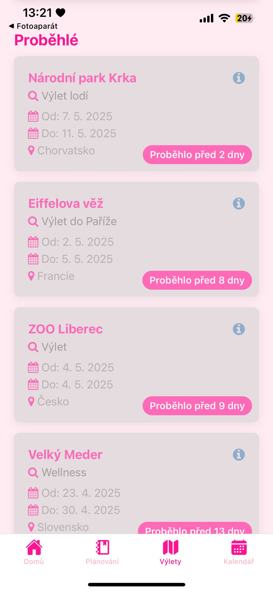

# Roamly – Mobilní aplikace pro plánování výletů

Aplikace **Roamly** slouží k plánování výletů a správě balicích seznamů podle typu výletu. Vyvinuto jako bakalářský projekt v rámci studia na **Technické univerzitě v Liberci**.

---

##  Funkce aplikace
- Přehled všech výletů rozdělený na:
  - **Aktuální výlety**
  - **Plánované výlety**
  - **Proběhlé výlety**
- Vytváření a úprava výletů
- Dostupný seznam věcí k zabalení s výchozími položkami podle typu výletu, možnost přidání vlastních
- Kalendář s přehledem naplánovaných výletů
- Ukládání dat pomocí **SQLite**

##  Použité technologie

- **React Native** (Expo)
- **SQLite** přes `expo-sqlite`
- Jazyk: **JavaScript**
- Platforma: **Android / iOS**

---

##  Ukázky z aplikace
<table>
  <tr>
    <td style="text-align: center; vertical-align: middle;">
      
    </td>
    <td style="text-align: center; vertical-align: middle;">
      
    </td>
  </tr>
  <tr>
    <td style="text-align: center; vertical-align: middle;">
      
      
    </td>
    <td style="text-align: center; vertical-align: middle;">
      
    </td>
  </tr>
</table>
